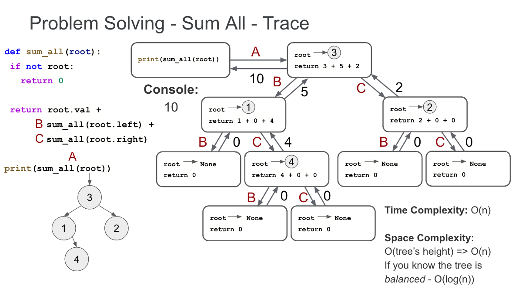
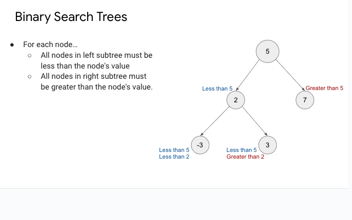

## Types Of Tree Traversal

---

### 1. Preorder Traversal
**Order**: 
- Root
- Left 
- Right 

**Description**:
- Begin from the root.
- Traverse the left subtree before the right subtree.
- In the subtree, the same logic applies: visit the root of the subtree first, then the left child and finally the right child.

---

### 2. Inorder Traversal
**Order**: 
- Left
- Root
- Right

**Description**:
- Begin from the leftmost node.
- After traversing the left subtree, visit the root.
- Finally, traverse the right subtree.
- This traversal, when applied on a binary search tree, visits the nodes in ascending order.

---

### 3. Post Order Traversal
**Order**:
- Left
- Right
- Root

**Description**:
- Begin from the leftmost node.
- Traverse the entirety of the left and right subtrees before visiting the root node.
- This kind of traversal is useful when deleting nodes from a tree, as children are deleted before their parent.

---

### 4. Level Order Traversal
**Description**:
- Also known as Breadth-First Search (BFS) for trees.
- Start at the root, and visit nodes level by level.
- Traverse all nodes of the current depth (or level) before moving on to nodes of the next depth.
- It's similar to how you might read English text: left to right, top to bottom.

---
### BINARY TREE PROPERTIES

- A binary tree is a tree in which each node must have no more than two children.
- The max total number of nodes in a binary tree is  2ℎ+1−1 , where  ℎ  is the height of the tree. 
- The number of nodes at any level of a binary tree is at most  2L , where  L  is the 0-indexed level of the node. (e.g. at level 1 there is a max of 21 nodes or 2 nodes

---
### Tree Recursion Working Mechanism 

---
### Binary Search Tree 

---
### TRIE

Trie is a very useful data structure. It is commonly used to represent a dictionary for looking up words in a vocabulary.

For example, consider the task of implementing a search bar with auto-completion or query suggestion. When the user enters a query, the search bar will automatically suggests common queries starting with the characters input by the user.

To implement such a function, we need several things at the backend. The first, obviously, is a list of common queries. Or it can be a list of proper English words for the purpose of auto-completion). Secondly, we will need to have an algorithm to quickly look up words starting with the characters input by the user, and this is where we need to use the trie data structure.

The follow example illustrates why a special data structure is necessary to look up words quickly given a prefix:

The user inputs the characters en
In our dictionary, we have the following words starting with en: english, entertainment
Commonly used data structures such as list and dictionary in Python do not allow quick look up of elements stored inside. For example, to see if there is any word having the prefix en in a Python dictionary, we cannot avoid going through each of the keys, resulting in O(n) time, where n is the number of entries in the dictionary
Trie is a tree-like data structure made up of nodes. Nodes can be used to store data. Each node may have none, one or more children. When used to store a vocabulary, each node is used to store a character, and consequently each "branch" of the trie represents a unique word. The following figure shows a trie with five words (was, wax, what, word, work) stored in it.

# How does a Trie Work?
There are two major operations that can be performed on a trie, namely:

- Inserting a word into the trie
- Searching for words using a prefix
#### Both operations involves traversing the trie by starting from the root node. We take a look at each of these operations in more detail.